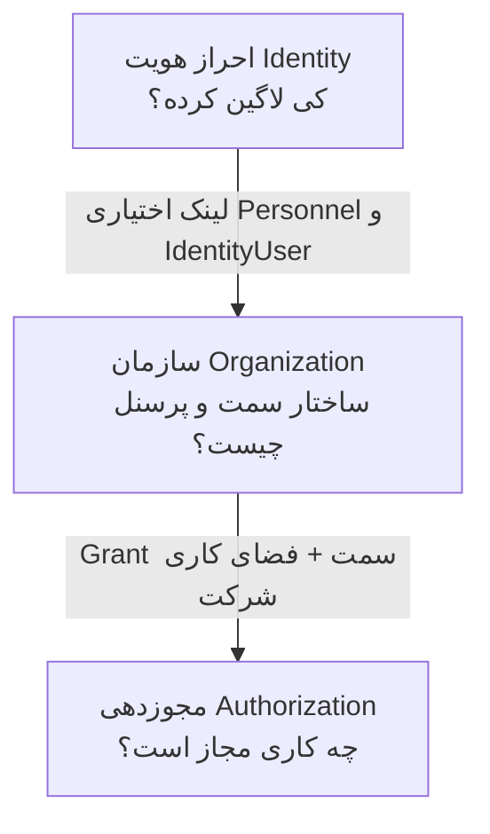
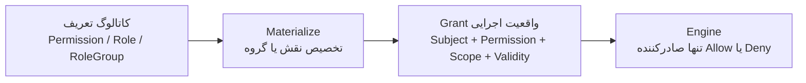
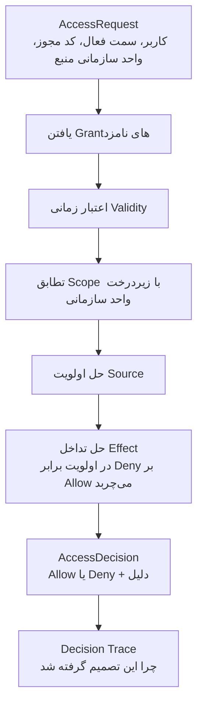
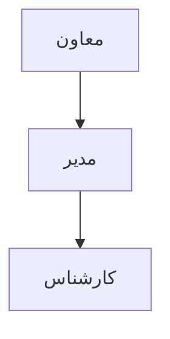
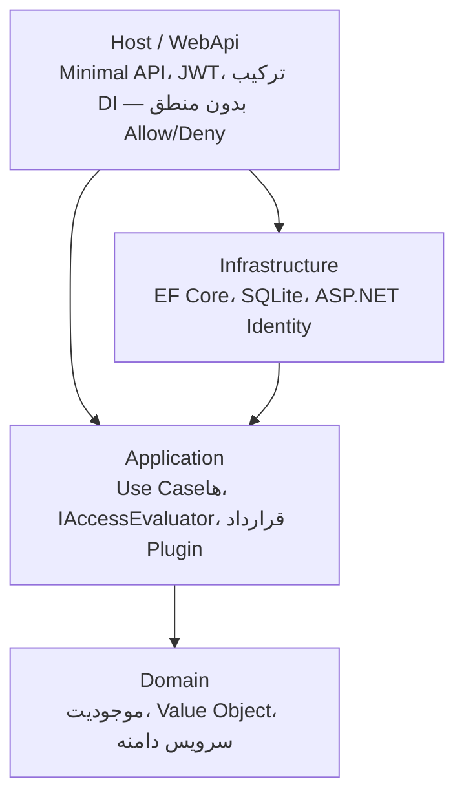

# Access Management Core

هستهٔ مجوزدهی محصول‌آگنوستیک روی **.NET 10** و **Clean Architecture**.

یک سؤال را برای هر محصول پاسخ می‌دهد:

> آیا **فرد X** می‌تواند **عمل Y** را روی **منبع Z** در **بستر C** انجام دهد؟

ماژول‌های کسب‌وکار منطق Allow/Deny را خودشان پیاده نمی‌کنند. آن‌ها `AccessRequest` می‌سازند و از `IAccessEvaluator` یک `AccessDecision` می‌گیرند.

دو اصل قفل‌شدهٔ معماری:

> **Grant = دادهٔ گنگ (dumb data).** فقط واقعیت را نگه می‌دارد؛ تصمیم نمی‌گیرد.
>
> **Access Evaluation Engine = تنها مالک Allow / Deny.** هیچ کنترلر، سرویس، یا ورک‌فلو حق صدور تصمیم نهایی را ندارد.

---

## فهرست

- [این سیستم چه کاری می‌کند؟](#این-سیستم-چه-کاری-میکند)
- [چطور این کار را می‌کند؟](#چطور-این-کار-را-میکند)
- [روی چه معماری سوار است؟](#روی-چه-معماری-سوار-است)
- [چطور در پروژه‌های دیگر استفاده شود؟](#چطور-در-پروژههای-دیگر-استفاده-شود)
- [شروع سریع](#شروع-سریع)
- [گروه‌های API](#گروههای-api)
- [ساختار ریپازیتوری](#ساختار-ریپازیتوری)
- [مستندات](#مستندات)

---

## این سیستم چه کاری می‌کند؟

سازمان‌های واقعی (کنترل کیفیت، هلدینگ چندشرکتی، و هر محصول مشابه) با این پیچیدگی‌ها روبه‌رو هستند:

- یک نفر ممکن است **چند سمت** در **چند شرکت** داشته باشد.
- دسترسی از **نقش**، **سمت سازمانی**، **واگذاری موقت (Delegation)**، یا **استثنای فردی** می‌آید.
- مدیر باید بفهمد **چرا** سیستم Allow یا Deny داده — نه فقط نتیجه.
- ماژول‌های محصول (BOM، Control Plan، آزمایشگاه، …) نباید موتور مجوزدهی را دوباره بنویسند.

این ریپازیتوری همان هسته است:

| کار | معنی |
|-----|------|
| احراز هویت | چه کسی لاگین کرده؟ (`ApplicationUser` + JWT) |
| سازمان | فرد در ساختار کجاست؟ (`Personnel`, `Position`, `PositionAssignment`) |
| مجوزدهی | چه عملی مجاز است؟ (`Permission`, `Grant`, Engine) |

Identity عمداً از Authorization جدا است ([ADR 0010](docs/decisions/0010-identity-vs-qc-role-separation.md)). `[Authorize(Roles=...)]` جایگزین Engine نیست.

---

## چطور این کار را می‌کند؟

### سه حوزهٔ جدا



| حوزه | سؤال | موجودیت‌های کلیدی |
|------|------|-------------------|
| Authentication | چه کسی وارد شده؟ | `ApplicationUser`, JWT |
| Organization | فرد در سازمان کجاست؟ | `Personnel`, `Position`, `PositionAssignment` |
| Authorization | چه عملی مجاز است؟ | `Permission`, `Grant`, `IAccessEvaluator` |

### کاتالوگ در برابر واقعیت

تعریف نقش با واقعیت اجرایی یکی نیست. نقش فقط می‌گوید «این بستهٔ مجوز وجود دارد». **Grant** می‌گوید «الان این فرد/سمت واقعاً این مجوز را دارد».



- **Grant دادهٔ گنگ است:** Subject، Permission، Effect، `ScopeUnitId`، ValidFrom/ValidTo، Priority، SourceType. متد تصمیم‌گیری ندارد.
- **RoleGroup** فقط دستهٔ Role است؛ به Permission وصل نیست. تخصیص گروه یعنی: `RoleGroup → Role → RolePermission → Grant`.
- **Scope رسمی** واحد سازمانی است: `Grant.ScopeUnitId` + درخت `OrganizationalUnit` + `ScopeMatcher`.

### خط لولهٔ ارزیابی

هر درخواست از همین مسیر عبور می‌کند. ورودی یکسان ⇒ خروجی و Trace یکسان.



اولویت منابع (از بالا به پایین):

```text
Individual Override  >  Position Override  >  Delegation  >  Role / RoleGroup  >  Propagated
```

### انتشار نامتقارن سمت (بدون Materialization در سلسله‌مراتب)

Grant سمت در زمان ارزیابی محاسبه می‌شود؛ ردیف جدید در دیتابیس برای پدر/فرزند ساخته نمی‌شود. تغییر درخت سمت فوراً روی نتیجه اثر می‌گذارد.



| قاعده | اثر |
|-------|-----|
| Grant روی سمت P | روی **P و اجداد P** مؤثر است (دسترسی به بالا می‌رود). |
| Revoke روی سمت P | روی **P و نوادگان P** مؤثر است (سلب به پایین می‌رود). |
| Grant فردی (`SourceType.User`) | به درخت سمت وصل نیست؛ فقط به همان کاربر. |

Revoke همیشه **غیرفعال‌سازی نرم** است (`Grant.Deactivate` → `ValidTo`). ردیف حذف نمی‌شود تا تاریخچهٔ Audit بماند.

---

## روی چه معماری سوار است؟

**Clean Architecture** با جهت وابستگی یک‌طرفه. قوانین لایه با `tests/ArchitectureTests` قفل شده‌اند.



| لایه | پروژه | حق ندارد |
|------|--------|----------|
| Domain | `AccessManagement.Domain` | EF Core، ASP.NET، Infrastructure، Web |
| Application | `AccessManagement.Application` | Infrastructure، Web — مستقیم با `IApplicationDbContext` کار می‌کند |
| Infrastructure | `AccessManagement.Infrastructure` | Web |
| Host | `src/Host/WebApi` | منطق مجوزدهی — فقط Engine را صدا می‌زند |

پشتهٔ فنی V1:

- .NET 10 / C#
- MediatR + FluentValidation
- EF Core 10 + SQLite (تعویض به SQL Server / PostgreSQL با تغییر connection string)
- ASP.NET Core Identity + JWT
- NUnit + Shouldly + NetArchTest

آنچه عمداً ساخته نشده: DSL مجوز، Rule Engine عمومی، انتشار Materializeشدهٔ سلسله‌مراتب سمت، باس رویداد، میکروسرویس توزیعی.

---

## چطور در پروژه‌های دیگر استفاده شود؟

هسته عمومی است. مجوزهای محصول (آزمایشگاه، Control Plan، BOM، …) داخل Core تعریف نمی‌شوند؛ از مسیر **Plugin** وارد می‌شوند.

### ۱. پروژه‌های Core را به Host محصول وصل کنید

```text
محصول شما
  ├── Host  ──AddAccessManagementCore()──►  AccessManagement.Application
  │         ──AddInfrastructureServices()►  AccessManagement.Infrastructure
  └── Your.AccessPlugin  ──IAccessPluginSeeder──►  Permissionها و ModuleScope محصول
```

در `Program.cs` محصول:

```csharp
builder.AddAccessManagementCore();
builder.Services.AddAccessPlugin<YourAccessSeeder>(); // یا کپی الگوی Qc.AccessPlugin
builder.AddInfrastructureServices();
builder.AddWebServices();
```

نمونهٔ آماده: [`Modules/Qc.AccessPlugin`](Modules/Qc.AccessPlugin) — این پروژه را کپی کنید، کدهای Permission خودتان را بگذارید، و Seeder را ثبت کنید.

### ۲. Permission محصول را Seed کنید

```csharp
public sealed class YourAccessSeeder : IAccessPluginSeeder
{
    public string PluginCode => "YOUR_PRODUCT";

    public async Task SeedAsync(IApplicationDbContext db, CancellationToken ct)
    {
        if (!db.Permissions.Any(p => p.Code == "INVOICE.APPROVE"))
            db.Permissions.Add(Permission.Create("INVOICE.APPROVE", "INVOICE", "APPROVE", pluginCode: PluginCode));

        await db.SaveChangesAsync(ct);
    }
}
```

### ۳. در Use Case کسب‌وکار فقط Engine را صدا بزنید

```csharp
var decision = await evaluator.EvaluateAsync(new AccessRequest(
    subjectUserId: currentUser.UserId!.Value,
    activePositionId: currentUser.ActivePositionId,
    permissionCode: "INVOICE.APPROVE",
    resourceScopeUnitId: invoice.CompanyUnitId,
    when: DateTimeOffset.UtcNow));

if (!decision.Allowed)
    throw new ForbiddenAccessException(decision.Reason);
```

قوانین محصول (وضعیت سند، گردش کار، اعتبار کسب‌وکار) مال دامنهٔ شماست. قوانین مجوز (Grant، Scope، اولویت، انتشار سمت) مال Core است.

### ۴. راه‌اندازی روی دیتابیس خالی

هر Deployment تازه تا ساختن اولین UserAdmin قفل است. مسیر Bootstrap بعد از اولین اجرا برای همیشه خاموش می‌شود.

1. `POST /api/users/register`
2. `POST /api/organization/bootstrap/admin` **بدون JWT** با `identityUserId` همان کاربر
3. Login — فراخوانی دوبارهٔ bootstrap با **409 Conflict** رد می‌شود

جزئیات در [شروع سریع](#شروع-سریع).

---

## شروع سریع

پیش‌نیاز: **.NET 10 SDK** (`10.0.101` یا هر 10.0.x با roll-forward). دیتابیس خارجی لازم نیست؛ SQLite در اولین اجرا ساخته می‌شود.

```bash
dotnet restore
dotnet build
dotnet test
dotnet run --project src/Host/WebApi
```

Migration دستی:

```bash
dotnet ef database update --project src/Core/AccessManagement.Infrastructure --startup-project src/Host/WebApi
```

آدرس پیش‌فرض را ASP.NET چاپ می‌کند. OpenAPI: `/openapi/v1.json`.

### First-time setup

1. ثبت کاربر: `POST /api/users/register`
2. ساخت اولین ادمین (بدون توکن): `POST /api/organization/bootstrap/admin`  
   بدنه: `nationalId`, `firstName`, `lastName`, `personnelCode`, `identityUserId`
3. Login با همان کاربر

---

## گروه‌های API

| گروه | مسیر | کاربرد |
|------|------|--------|
| `UsersEndpoints` | `/api/users` | ثبت‌نام، ورود، workspace، تعویض شرکت |
| `OrganizationEndpoints` | `/api/organization` | پرسنل، سمت، انتساب، bootstrap ادمین |
| `AuthorizationEndpoints` | `/api/authorization` | Grant/Revoke، ارزیابی، scopeهای در دسترس |
| `AccessDefinitionEndpoints` | کاتالوگ | Permission، Role، RoleGroup |
| `DelegationEndpoints` | واگذاری | ایجاد و ابطال Delegation |
| `AuditEndpoints` | حسابرسی | ردپای تصمیم و تغییرات Grant |

---

## ساختار ریپازیتوری

```text
docs/                  معماری، مدل ذهنی فارسی، مشخصات یکپارچه‌سازی، ADRها
src/
  Core/
    AccessManagement.Domain/         موجودیت و سرویس دامنه
    AccessManagement.Application/    Use Case، Engine، قرارداد Plugin
    AccessManagement.Infrastructure/ EF Core + SQLite + Identity
  Host/WebApi/                       Minimal API
  Shared/                            primitives مشترک
  ServiceDefaults/                   مشاهده‌پذیری پیش‌فرض
Modules/Qc.AccessPlugin/             نمونهٔ Plugin محصول QC
tests/
  Domain.UnitTests/
  Application.UnitTests/
  Infrastructure.IntegrationTests/
  ArchitectureTests/                 دروازهٔ جهت وابستگی لایه‌ها
```

---

## مستندات

| سند | محتوا |
|-----|--------|
| [docs/ARCHITECTURE.md](docs/ARCHITECTURE.md) | خلاصهٔ معماری و قیود قفل‌شده |
| [docs/DESIGN_MENTAL_MODEL.md](docs/DESIGN_MENTAL_MODEL.md) | مدل ذهنی محصول به فارسی |
| [docs/INTEGRATION_SPECIFICATION.md](docs/INTEGRATION_SPECIFICATION.md) | نحوهٔ مصرف Core در ماژول‌های کسب‌وکار |
| [docs/decisions/](docs/decisions/) | Architecture Decision Records |
| [docs/TESTING.md](docs/TESTING.md) | استراتژی تست |

---

## License

This is a private project. No license granted.
