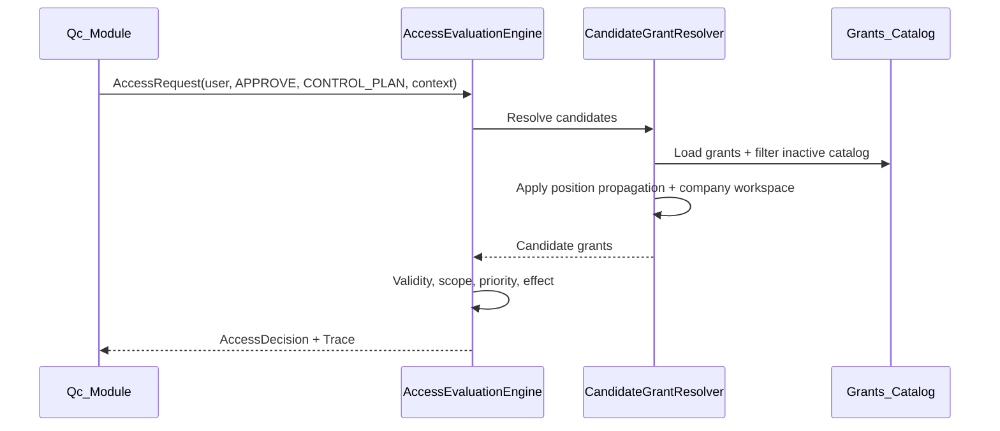

# مدل ذهنی طراحی — سیستم مجوزدهی Qc Authorization

**وضعیت:** سند مرجع محصول و معماری  
**مخاطب:** تیم توسعه، معمار، مدیر محصول، بازبین فنی  
**زبان:** فارسی — نام موجودیت‌ها و APIها به انگلیسی حفظ شده‌اند.

---

## ۱. این محصول چه مشکلی را حل می‌کند؟

سازمان‌های QC (کنترل کیفیت) نیاز دارند بدانند:

> **آیا فرد X می‌تواند عمل Y را روی منبع Z در بستر C انجام دهد؟**

این سؤال ساده است، اما پاسخ آن در دنیای واقعی پیچیده می‌شود چون:

- یک نفر ممکن است **چند سمت سازمانی** در **چند شرکت** داشته باشد.
- دسترسی می‌تواند از **نقش**، **سمت**، **واگذاری موقت**، یا **استثنای فردی** بیاید.
- مدیران باید بتوانند بفهمند **چرا** سیستم Allow یا Deny داده — نه فقط نتیجه.
- ماژول‌های کسب‌وکار (BOM، Control Plan، آزمایشگاه و …) نباید منطق مجوزدهی را دوباره پیاده کنند.

**Qc Authorization** یک **هستهٔ مجوزدهی عمومی** است که این سؤال را یک‌بار و درست پاسخ می‌دهد. ماژول‌های QC فقط `AccessRequest` می‌سازند و `AccessDecision` می‌گیرند.

---

## ۲. مدل ذهنی سه‌گانه

ذهنیت طراحی روی **سه حوزهٔ جدا** استوار است. اگر این مرزها را رعایت نکنیم، سیستم در هم می‌ریزد.

```text
┌─────────────────────────────────────────────────────────────┐
│  Authentication (Identity)                                   │
│  «کی لاگین کرده؟» — ApplicationUser، JWT، رمز عبور          │
└──────────────────────────┬──────────────────────────────────┘
                           │ اختیاری: Personnel ↔ IdentityUser
┌──────────────────────────▼──────────────────────────────────┐
│  Organization                                               │
│  «ساختار سازمانی چیست؟» — Personnel، Position، Assignment  │
└──────────────────────────┬──────────────────────────────────┘
                           │ Position grants + workspace
┌──────────────────────────▼──────────────────────────────────┐
│  Authorization (Core)                                       │
│  «چه کاری مجاز است؟» — Permission، Grant، Engine           │
└─────────────────────────────────────────────────────────────┘
```

| حوزه | سوال | موجودیت‌های کلیدی |
|------|------|-------------------|
| **Authentication** | چه کسی وارد سیستم شده؟ | `ApplicationUser`, `ApplicationRole` (نازک) |
| **Organization** | فرد در سازمان کجا قرار دارد؟ | `Personnel`, `Position`, `PositionAssignment` |
| **Authorization** | چه عملی مجاز است؟ | `Permission`, `Grant`, `AccessEvaluationEngine` |

**اصل طلایی:** Identity می‌گوید *کی هستی*؛ Authorization می‌گوید *چه کار می‌توانی بکنی*. این دو عمداً جدا هستند (ADR 0010).

---

## ۳. دو نوع داده: کاتالوگ در مقابل واقعیت (Fact)

مدل ذهنی دوم تفکیک **تعریف** از **واقعیت اجرایی** است:

```text
کاتالوگ (Definition)              واقعیت (Runtime Fact)
─────────────────────             ─────────────────────
ResourceCatalog                   Grant
ActionCatalog                       ↑
Permission                          │
Role ── RolePermission              │ materialize
RoleGroup ── RoleGroupMember        │
Delegation (نیمه‌کاتالوگ)           │
```

| لایه | ماهیت | مثال |
|------|--------|------|
| **کاتالوگ** | «چه چیزهایی وجود دارد؟» | نقش `QC_MANAGER` شامل `CONTROL_PLAN.APPROVE` |
| **Grant** | «الان چه کسی واقعاً این دسترسی را دارد؟» | ردیف Grant با Subject، Validity، Source |

**چرا Grant جدا از Role است؟**  
چون یک نقش می‌تواند به صدها کاربر یا سمت assign شود، هر کدام با **پنجرهٔ زمانی** و **scope** متفاوت. کاتالوگ نقش فقط *تعریف* است؛ Grant *واقعیت قابل ارزیابی* است.

---

## ۴. موجودیت‌ها و دلیل وجود هر کدام

### ۴.۱ لایهٔ کاتالوگ مجوز

#### `ResourceCatalog` و `ActionCatalog`
- **نقش:** واژگان ثابت دامنه — «چه منابعی» و «چه عملیاتی» در سیستم تعریف شده‌اند.
- **چرا جدا از Permission؟** تا admin بتواند منابع و اعمال را مستقل مدیریت کند و Permission از ترکیب آن‌ها ساخته شود (`PERSONNEL.READ`).
- **دفاع:** بدون کاتالوگ، رشته‌های پراکنده در کد پر می‌شوند و یکپارچگی از بین می‌رود.

#### `Permission`
- **نقش:** اتم مجوز — ترکیب `Resource + Action` با کد یکتا (`CONTROL_PLAN.APPROVE`).
- **چرا موجودیت مستقل؟** Engine فقط با Permission کار می‌کند؛ ماژول‌های QC فقط action/resource را می‌فرستند.
- **دفاع:** Permission زبان مشترک بین همهٔ ماژول‌هاست. BOM و Control Plan هر دو از همان واژگان استفاده می‌کنند.

#### `Role` (نقش مجوزدهی — نه Identity Role)
- **نقش:** بستهٔ کاتالوگی از Permissionها برای نقش‌های شغلی/عملیاتی.
- **رابطه:** `RolePermission` (many-to-many با Permission).
- **`CatalogStatus`:** Active/Inactive — غیرفعال‌سازی بدون حذف تاریخچه.
- **چرا جدا از `ApplicationRole`؟** Identity Role فقط membership لاگین است؛ Qc Role دارای Code، FK به Permission، materialization به Grant، revoke و trace است (ADR 0010).

#### `RoleGroup`
- **نقش:** **دسته‌بندی نقش‌ها** — admin یک گروه از Roleها را یک‌جا assign می‌کند.
- **مهم:** RoleGroup **هیچ ارتباط مستقیمی با Permission ندارد** (ADR 0011، 0012). فقط `RoleGroupMember` دارد.
- **جریان materialize:**
  ```text
  RoleGroup → RoleGroupMember → Role → RolePermission → Grant (SourceType.RoleGroup)
  ```
- **دفاع در برابر «چرا Permission روی گروه نیست؟»**  
  گروه نقش = گروه نقش. اگر Permission مستقیم روی گروه باشد، دو مسیر تعریف مجوز ایجاد می‌شود (روی Role و روی Group) و مدل ذهنی شکسته می‌شود. همهٔ مجوزها از Role می‌آیند؛ Group فقط راحتی admin است.

---

### ۴.۲ لایهٔ واقعیت — `Grant`

- **نقش:** **تنها شکل داده‌ای که Engine می‌خواند** برای تصمیم Allow/Deny.
- **ویژگی‌ها:** Subject، Permission، Effect، Scope، Validity، Priority، SourceType/SourceId.
- **اصل:** Grant = dumb data — هیچ متدی برای «تصمیم‌گیری» ندارد (ADR 0001).
- **چرا materialize می‌کنیم؟**  
  - Revoke دقیق: حذف Grantهای یک Role assignment مشخص.  
  - Trace: می‌دانیم دسترسی از کجا آمده (`SourceType.Role`, `SourceId`).  
  - یک Engine برای همهٔ منابع — Role، Position، User، Delegation هم‌شکل دیده می‌شوند.

| `SourceType` | معنی |
|--------------|------|
| `User` | استثنای فردی |
| `Position` | دسترسی سمت سازمانی |
| `Role` | materialize از assign نقش به User/Position |
| `RoleGroup` | materialize از assign گروه به User/Position |
| `Delegation` | واگذاری موقت از یک کاربر به دیگری |

---

### ۴.۳ لایهٔ سازمان

#### `Personnel`
- **نقش:** موجودیت **انسانی/HR** — کد پرسنلی، کد ملی، نام.
- **چرا جدا از `ApplicationUser`؟**  
  - پرسنل می‌تواند بدون حساب کاربری وجود داشته باشد.  
  - کاربر خارجی (مشاور) می‌تواند بدون Personnel لاگین کند.  
  - لینک اختیاری: `Personnel.IdentityUserId` (ADR 0011).

#### `Position`
- **نقش:** **سمت سازمانی** در یک شرکت — عنوان، کد، سلسله‌مراتب (`ParentPositionId`).
- **`CompanyId`:** مرجع به شرکت (بدون aggregate Company در این bounded context — عمداً ساده نگه داشته شده).
- **چرا Grant روی Position؟** دسترسی شغلی باید با تغییر سمت یا جابه‌جایی در درخت سازمان، **در زمان ارزیابی** propagate شود — نه با کپی دستی به هر کاربر.

#### `PositionAssignment`
- **نقش:** اتصال Personnel به Position با بازهٔ اعتبار (`ValidFrom`/`ValidTo`).
- **`IsPrimary`:** شرکت پیش‌فرض در login و workspace.
- **دفاع:** بدون assignment، نمی‌دانیم کاربر در کدام شرکت و کدام سمت است؛ position grantها اعمال نمی‌شوند.

---

### ۴.۴ `Delegation`
- **نقش:** واگذاری **موقت** یک Permission از delegator به delegatee.
- **قوانین:** delegator باید خودش دسترسی داشته باشد (subset policy)؛ delegatee ترجیحاً زیردست سازمانی باشد (hierarchy policy) مگر delegator دسترسی unbounded داشته باشد.
- **چرا موجودیت جدا؟** واگذاری lifecycle، validity و `Delegable` flag دارد — با Grant معمولی قابل مدل‌سازی تمیز نیست.

#### `AuthorizationAuditEntry`
- **نقش:** ثبت رویدادهای admin (assign، revoke، update) با payload ساخت‌یافته برای بازبینی.

---

### ۴.۵ موتور ارزیابی — `AccessEvaluationEngine`

- **نقش:** **تنها مالک تصمیم Allow/Deny** (ADR 0002).
- **ورودی:** `AccessRequest` (subject، permission، resource، context مثل CompanyId).
- **خروجی:** `AccessDecision` + `DecisionTrace` کامل.
- **مراحل:** یافتن candidate grants → validity → scope → constraints → priority → effect → trace.

**چرا هیچ controller یا use case نباید خودش Allow/Deny بزند؟**  
تا رفتار یکسان، قابل تست و قابل audit باشد. QC integration فقط engine را صدا می‌زند.

---

## ۵. الگوهای طراحی که از آن‌ها دفاع می‌کنیم

### ۵.۱ Propagation محاسباتی، نه materialize شده (ADR 0004)

وقتی Grant روی Position `P` ثبت می‌شود:
- **Grant:** موثر روی `P` + **Ancestors(P)** (بالا می‌رود).
- **Revoke:** موثر روی `P` + **Descendants(P)** (پایین می‌رود).

این **نامتقارن** است (ADR 0003) و عمدی است — grant و revoke دو قانون کسب‌وکار مستقل‌اند.

**دفاع:** اگر propagation را materialize کنیم، با هر تغییر در درخت سازمان باید هزاران Grant را sync کنیم. محاسبه در evaluation = همیشه به‌روز.

### ۵.۲ اولویت مبتنی بر منبع (ADR 0006)

```text
Individual Override > Position Override > Delegation > Role/RoleGroup > Propagated
```

در یک سطح، `Deny > Allow` برای determinism.

### ۵.۳ Multi-company workspace

- یک Personnel می‌تواند در چند شرکت سمت داشته باشد.
- JWT: `active_company_id` — position grantها **فقط در شرکت فعال** union می‌شوند.
- **دفاع:** union کردن grantهای همهٔ شرکت‌ها در یک evaluation، نشت دسترسی بین شرکت‌هاست.

### ۵.۴ Constraintهای typed، نه DSL (ADR 0009)

`AmountConstraint`, `TimeConstraint`, `ScopeConstraint` — هر کدام کلاس مشخص.  
**دفاع:** DSL/generic rule engine هزینهٔ نگهداری، امنیت و تست را بالا می‌برد بدون نیاز فعلی QC.

### ۵.۵ Guid برای همهٔ شناسه‌ها

یکپارچگی با Identity، ادغام سیستم‌ها، و جلوگیری از collision در merge داده.

---

## ۶. جریان end-to-end (مدل ذهنی یک درخواست)



---

## ۷. چه چیزهایی عمداً ساخته نشده‌اند

| مورد | دلیل تأخیر |
|------|------------|
| Holding aggregate | `CompanyId` روی Position کافی است در این فاز |
| Role parent inheritance | تغییر مدل جدا — بعداً |
| Permission مستقیم روی RoleGroup | رد شد — گروه فقط Role bundle است (ADR 0012) |
| Rule engine / DSL | پیچیدگی بدون use case |
| Materialized propagation | محاسبه در runtime کافی و صحیح‌تر است |
| UI admin panel | فاز backend/API |

این محدودیت‌ها **بدهی فنی نیستند** — مرز scope آگاهانه‌اند.

---

## ۸. پاسخ به سوالات و انتقادات رایج

### «چرا Role و Grant جدا هستند؟»
Role = تعریف نقش در کاتالوگ. Grant = واقعیت assign با validity و source. بدون این تفکیک، revoke، trace و بازهٔ زمانی غیرممکن یا پراکنده می‌شود.

### «چرا Identity Role را گسترش ندادیم؟»
16 معیار در ADR 0010 نشان داد: `IdentityRoleClaim` FK به Permission ندارد، scope/effect/priority/trace ندارد، RoleGroup و position propagation را پوشش نمی‌دهد. Path C (جدا نگه داشتن) کم‌ریسک‌تر و قابل دفاع‌تر است.

### «چرا RoleGroup به Permission وصل نیست؟»
گروه نقش یعنی دسته‌بندی نقش‌ها. مجوز فقط روی Role تعریف می‌شود. یک مسیر تعریف = یک مدل ذهنی = کمتر اشتباه admin.

### «چرا Personnel و User جدا هستند؟»
دنیای HR ≠ دنیای login. مشاور خارجی، پرسنل بدون سیستم، و لینک بعدی همه use case واقعی QC هستند.

### «Engine خیلی سنگین نیست؟»
سنگینی در **پیچیدگی پنهان** جاهای دیگر (if/else در هر controller) بیشتر است. Engine یک‌بار درست پیاده می‌شود، 152+ تست دارد، و trace می‌دهد.

### «SQLite برای production؟»
V1 و توسعه (ADR 0008). لایه Domain/Application از persistence جداست؛ تعویض provider بدون تغییر منطق مجوز ممکن است.

---

## ۹. نقشهٔ مستندات مرتبط

| سند | محتوا |
|-----|--------|
| [ARCHITECTURE.md](ARCHITECTURE.md) | خلاصهٔ فنی انگلیسی |
| [INTEGRATION_SPECIFICATION.md](INTEGRATION_SPECIFICATION.md) | نحوهٔ مصرف توسط ماژول‌های QC |
| [decisions/](decisions/) | ADRهای 0001–0012 — دلیل هر تصمیم |
| [decisions/0011-personnel-user-role-group.md](decisions/0011-personnel-user-role-group.md) | Personnel/User/RoleGroup |
| [decisions/0012-hybrid-rolegroup-permissions.md](decisions/0012-hybrid-rolegroup-permissions.md) | رد مدل hybrid — RoleGroup فقط Role |

---

## ۱۰. جمع‌بندی — یک جمله برای هر لایه

| لایه | یک جمله |
|------|---------|
| **Permission** | زبان مشترک «چه کاری» |
| **Role** | بستهٔ مجوزهای شغلی در کاتالوگ |
| **RoleGroup** | دسته‌بندی Roleها برای راحتی admin — بدون Permission |
| **Grant** | واقعیت قابل ارزیابی — dumb fact |
| **Position** | سمت سازمانی که grant روی آن propagate می‌شود |
| **Personnel** | انسان در سازمان — مستقل از login |
| **Engine** | تنها جایی که Allow/Deny تولید می‌شود |
| **Trace** | پاسخ به «چرا؟» |

این سیستم عمداً **generic** است: QC فقط consumer است. هسته ثابت می‌ماند؛ دامنهٔ کسب‌وکار رشد می‌کند — بدون کپی کردن منطق مجوزدهی در هر ماژول.

---

*آخرین هم‌راستاسازی با کد: شاخهٔ `feature/qc-business-integration` — RoleGroup role-only، CatalogStatus، multi-company workspace، Guid IDs.*
